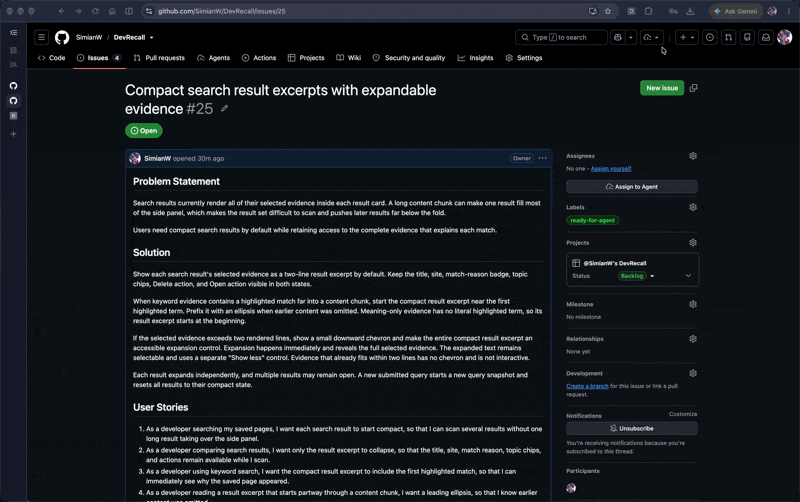
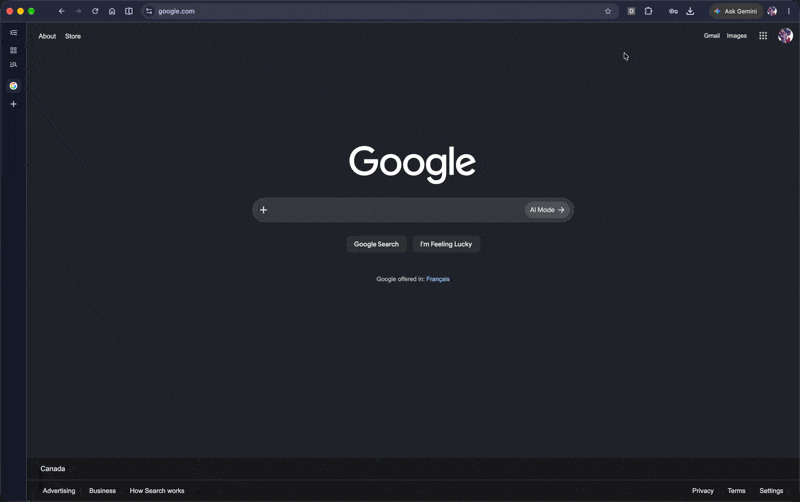

# DevRecall

DevRecall is a Chrome extension that helps you save useful technical pages and find them again when you need them.

## Demo

### Save a technical page locally

Open DevRecall from the Chrome toolbar and save the page you are viewing.



### Find it later by keyword or meaning

Search your saved pages by keyword, or use Hybrid search to find a page by what it means.



## What you can do

- Save documentation, GitHub pages, Stack Overflow answers, articles, and other technical references.
- Search page text, titles, summaries, topics, technologies, and URLs. Technical names such as C++, C#, and camelCase identifiers are searchable.
- Use optional AI features for summaries, topics, technologies, and meaning-based search.
- Turn on auto-save for common developer sites.
- Filter your entire library by site and content type, including older pages. Load more pages to keep browsing.
- See highlighted matching fields, expand search evidence, and retry failed operations.
- Export, restore, or delete your library from Settings.

## How it works

Open DevRecall from the Chrome toolbar. Save the page you are viewing, then use the side panel to search or browse your library.

Every page is saved locally first, so saving and keyword search work without an API key. If you want AI summaries or meaning-based search, add your own OpenAI API key in DevRecall's settings.

## Install from source

Requirements: Node.js 20 or newer, pnpm 9 or newer, and Chrome or Chromium.

```bash
pnpm install
pnpm build
```

Then open `chrome://extensions`, enable Developer mode, choose **Load unpacked**, and select this repository's `dist` directory. Click the DevRecall toolbar icon to open the side panel.

## Choose how DevRecall uses AI

**Local-only** keeps automatic saving and search on your device. DevRecall contacts OpenAI only when you choose an AI action for a saved page.

**Hybrid** adds AI summaries and meaning-based search when an OpenAI API key is available. Page content and search queries may be sent to OpenAI while you use these features.

If an AI request fails, your locally saved page and keyword search still work.

## Find pages faster

Use `/` or `Ctrl+K` on Windows/Linux, or `Cmd+K` on macOS, to focus search inside the side panel. Press `Escape` to clear your query. Filters apply before search results are limited, so selecting Docs can find pages beyond the unfiltered first ten results.

Search updates when pages are saved, removed, or restored while the side panel is open. Matching text is highlighted in the title, summary, URL, topics, technologies, or body. Choose **Show details** to inspect the saved page's content and metadata.

Saving the current page and toggling the panel can also be assigned browser-wide shortcuts at `chrome://extensions/shortcuts`.

## Your data

DevRecall stores your library and API key in your browser profile. It does not have a separate account or sync service.

You stay in control of when AI features are used, and you can export or delete your saved data from the settings page.

To restore an export, open **Settings → Data Management → Import backup**, choose the JSON file, review its page count, and confirm. Restore supports version 1 DevRecall exports up to 25 MB and 5,000 pages. It keeps existing pages, skips duplicate normalized URLs, and restores saved text, summaries, topics, and technologies. If a write fails, the import rolls back.

Restoring rebuilds keyword search locally and never calls OpenAI. Exports do not include the API key, settings, or vector embeddings; optional AI processing can be run afterward. Keep the JSON file private because it contains your saved page text and URLs.

## Development

The [one-hour upgrade wrap-up](docs/assets/one-hour-wrap-up.prototype.html) is a standalone Chinese HTML report with an in-memory walkthrough. Download and open it directly; it is not part of the extension build.

```bash
pnpm dev          # Start the Vite development server
pnpm test         # Run the test suite once
pnpm typecheck    # Check TypeScript
pnpm lint         # Run ESLint
pnpm format:check # Check formatting
pnpm build        # Create the production extension in dist
```
